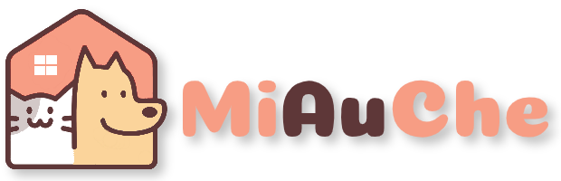

<h1 align="center">
  
</h1> 

  
 

   

<strong>
 

  <a href="#bookmark-about">Sobre</a>&nbsp;&nbsp;&nbsp;|&nbsp;&nbsp;&nbsp;
  <a href="#computer-technologies">Tecnologias</a>&nbsp;&nbsp;&nbsp;|&nbsp;&nbsp;&nbsp;
  <a href="#wrench-tools">Ferramentas</a>&nbsp;&nbsp;&nbsp;|&nbsp;&nbsp;&nbsp;
  <a href="#memo-license">Licença</a>

</strong>
 

##  Sobre

**MiAuChe** é uma aplicação **ainda em desenvolvimento** inspirada na ideia do projeto do último NLW da Rocketseat que visa dar mais visibilidade e informação sobre abrigos de animais tornando-os mais acessíveis a receberem ajudas e doações.

 

##  Tecnologias

-  **[Typescript](https://www.typescriptlang.org/)**
-  **[ReactJS](https://reactjs.org/)**
-  **[Redux](https://redux.js.org/)**
-  **[styled-components](https://styled-components.com/)**
-  **[Axios](https://github.com/axios/axios)**
-  **[Leaflet](https://leafletjs.coma)**

 

##  Ferramentas

- **[VisualStudio Code](https://code.visualstudio.com/)**
- **[Google Chrome](https://www.google.com/chrome/)**

 

##  Licença

Este projeto está sobre uma licença **MIT**.
